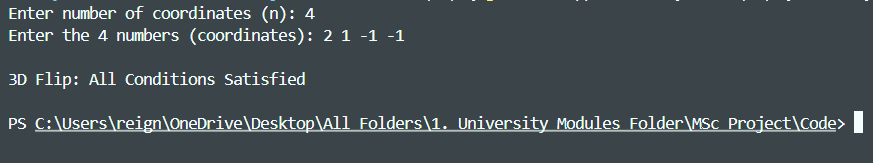
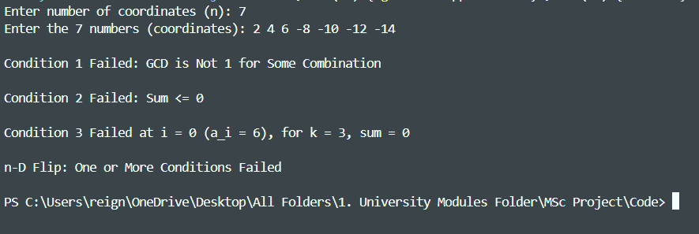
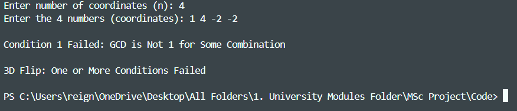
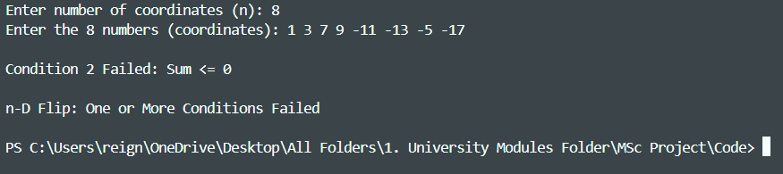
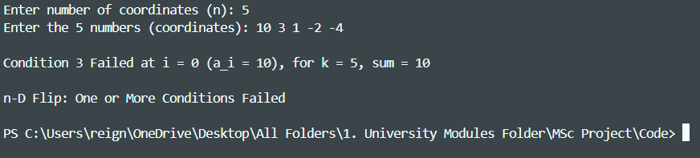
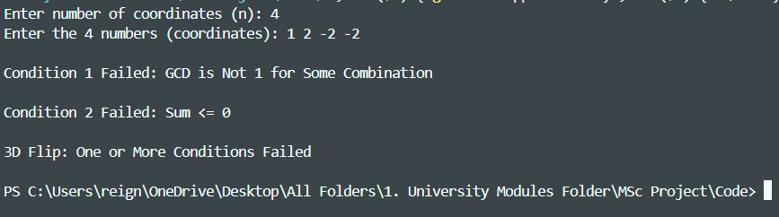
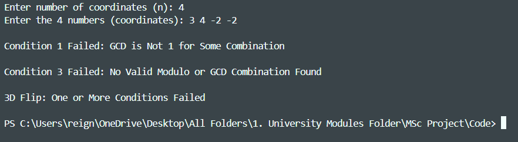
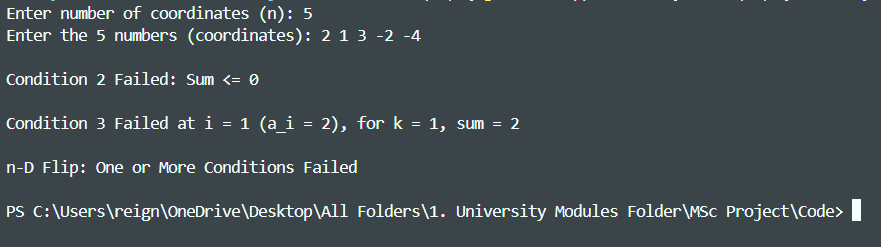
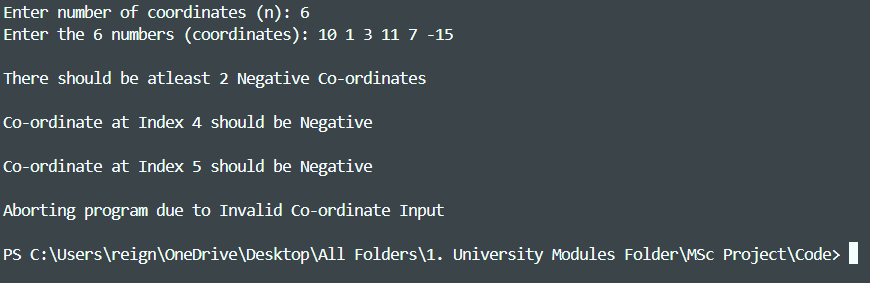
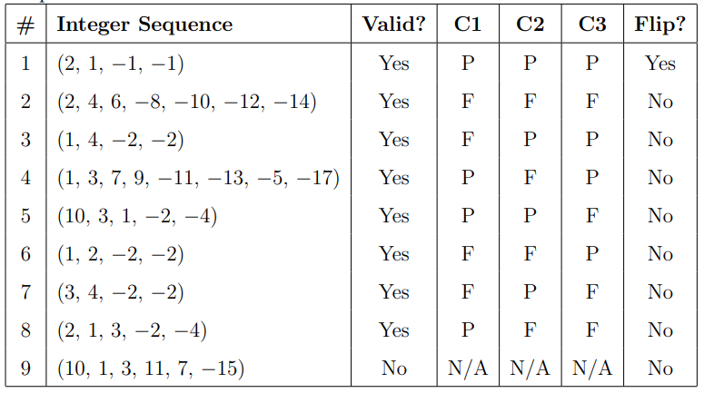

# Algorithmic Verification of Combinatorial Flips in Integer Sequences

MSc Data Science dissertation (University of Nottingham) developing a C++ framework that algorithmically verifies whether an integer sequence represents a valid "flip" — a structure from birational algebraic geometry's Minimal Model Program — by translating abstract algebraic conditions into concrete, efficient number-theoretic checks.

**Author:** Ayush Saxena · [reignofayush@gmail.com](mailto:reignofayush@gmail.com) <br/>
**Supervisor:** Prof. Hamid Abban, School of Mathematical Science, University of Nottingham <br/>
**Submitted:** September 2025, in partial fulfillment of the MSc Data Science degree

---

## Overview

Flips are a foundational construction in the Minimal Model Program (MMP) — the framework, shaped by Mori and others, for classifying algebraic varieties up to birational equivalence. Verifying whether a given configuration constitutes a valid flip is traditionally handled through abstract algebraic tools: graded rings, ideals, and quotient constructions. This dissertation asks a more concrete question: **can flip validity be checked computationally, directly on an integer sequence, without invoking the full machinery of symbolic algebra?**

The answer developed here is yes. The dissertation formalises three necessary conditions on an integer vector $a = (a_1, \dots, a_n)$ that together determine flip validity, then implements them as an efficient C++ program.

## What This Project Achieves

To the best of my research, there was no existing online tool, calculator, or open codebase that could take an arbitrary integer sequence and determine whether it represents a valid combinatorial flip — verification of flips has historically stayed within symbolic/abstract algebra (graded rings, ideals, Gröbner bases), not something you could just run a program against.

This project closes that gap: given any integer sequence of length $n > 3$, the program tells you definitively whether it's a valid flip, and if not, *exactly* which of the three necessary conditions fail and why — something the purely symbolic approach doesn't give you for free. It's a small, single-file, dependency-free tool, so it's also trivially reproducible and easy to build on. The scalability limitation discussed below (driven by the exponential cost of Condition 1's subset generation, and Condition 3's dependence on coordinate magnitude) is real, but it doesn't take away from the fact that, within its practical range, this is — as far as I could establish — the first concrete, runnable tool for numerically verifying flips.

## The Three Conditions

**C1 — Coprimality of every $(n-1)$-subset:** for every index $i$, the GCD of all coordinates except $a_i$ must equal 1:

$$\gcd(a_j \mid 1 \le j \le n,\ j \ne i) = 1 \quad \forall i$$

**C2 — Positivity of the total sum:**

$$\sum_{i=1}^{n} a_i > 0$$

**C3 — Modular sum inequality:** for every positive coordinate $a_i$ and every $k \in \{1, \dots, a_i - 1\}$:

$$\sum_{j \ne i} \big((a_j \bmod a_i) \cdot k \bmod a_i\big) > a_i$$

A sequence is a valid flip **if and only if all three hold simultaneously**. C3 is the most intricate — and, as the results below show, the hardest to satisfy in higher dimensions, consistent with the known geometric delicacy of flips in the MMP.

## Implementation

The three conditions are backed by a small set of general-purpose utility functions, each chosen deliberately:

- **`computeGCD`** — iterative Euclidean algorithm, $O(\log M)$ where $M = \max(|a|,|b|)$. A recursive equivalent is included (commented) purely to show the two are interchangeable; the iterative version was kept for speed and to avoid call-stack overhead.
- **`computeGCDofList`** — folds `computeGCD` across a list using $\gcd(a,b,c) = \gcd(\gcd(a,b), c)$, $O(n \log M)$.
- **`generateCombinations`** — backtracking generation of all $(n-1)$-element subsets for C1.
- **`quickSort`** — custom in-place Quicksort ($O(n \log n)$ average) used to sort coordinates before evaluation, chosen over Merge Sort for its $O(\log n)$ auxiliary space.
- **`isFixValid`** — pairwise modulo/GCD helper specific to the 3-dimensional case (`condition3_3D`).

## Results

Nine test cases were run to validate the implementation, chosen to isolate every combination of pass/fail across the three conditions:

| # | Sequence | Valid Input? | C1 | C2 | C3 | Flip? |
|---|---|---|---|---|---|---|
| 1 | (2, 1, −1, −1) | Yes | ✅ | ✅ | ✅ | **Yes** |
| 2 | (2, 4, 6, −8, −10, −12, −14) | Yes | ❌ | ❌ | ❌ | No |
| 3 | (1, 4, −2, −2) | Yes | ❌ | ✅ | ✅ | No |
| 4 | (1, 3, 7, 9, −11, −13, −5, −17) | Yes | ✅ | ❌ | ✅ | No |
| 5 | (10, 3, 1, −2, −4) | Yes | ✅ | ✅ | ❌ | No |
| 6 | (1, 2, −2, −2) | Yes | ❌ | ❌ | ✅ | No |
| 7 | (3, 4, −2, −2) | Yes | ❌ | ✅ | ❌ | No |
| 8 | (2, 1, 3, −2, −4) | Yes | ✅ | ❌ | ❌ | No |
| 9 | (10, 1, 3, 11, 7, −15) | **No** (only 1 negative coordinate) | N/A | N/A | N/A | No |

Only Case 1 satisfies all three conditions and is correctly classified as a flip. Case 9 demonstrates the program's input validation: a flip requires at least two negative coordinates (so that the positive and negative "sides" can form dimensionally compatible geometric objects) — the program correctly aborts evaluation rather than running the conditions on structurally invalid input.












## Complexity Analysis

Let $n$ be the dimension and $S^+ = \sum_{a_i > 0} a_i$. The leading terms of the overall runtime are:

$$O(n \log n) \text{ (sorting)} + O(n^2 \log M) \text{ (C1)} + O(n \cdot S^+) \text{ (C3, n-D)}$$

**Condition 3 dominates in practice** — its cost grows with the *magnitude* of the positive coordinates, not just the dimension, so inputs with a few large positive values are the real scalability bottleneck, not high dimensionality alone.

Several concrete optimisations are identified in the dissertation for future work, including:
- Reducing C1 from $O(n^2 \log M)$ to $O(n \log M)$ using prefix/suffix GCD arrays instead of explicit subset generation
- Precomputing residues once per fixed $a_i$ outside the C3 inner loop
- Using `int64_t` accumulators in C3 to guard against overflow on large, high-dimensional inputs

## Limitations

- **Exponential subset generation for C1** — backtracking over all $(n-1)$-subsets is fine for moderate dimensions but scales poorly for very large $n$, where the prefix/suffix GCD optimisation above becomes necessary.
- **C3's cost scales with coordinate magnitude**, not just dimension — large positive coordinates significantly increase runtime even for small $n$.

## Tech Stack

`C++` (single-file implementation, standard library only — no external dependencies)

## Repository Structure

```
├── Ayush_Saxena_20645113_Dissertation_Source_Code.cpp     # Full flip-verification implementation
├── Ayush_Saxena_20645113_MSc_Dissertation.pdf             # Full dissertation
├── images/                                                # Result screenshots referenced in this README
└── README.md
```

## Compiling & Running

```bash
g++ -O2 -o flip_check Ayush_Saxena_20645113_Dissertation_Source_Code.cpp
./flip_check
```

The program prompts for the number of coordinates $n$ (must be $> 3$) followed by the $n$ integer values, then reports which of C1/C2/C3 pass or fail and whether the input is a valid flip in 3D ($n=4$) or $n$-D ($n>4$).

## Full Write-Up

The complete dissertation — covering the group theory and ring theory background, the algebraic-to-geometric bridge for flips, symbolic computation and ideal membership, the full mathematical derivation of the three conditions, pseudocode, and the discussion/limitations/future work chapters — is included in full: [`Ayush_Saxena_20645113_MSc_Dissertation.pdf`](Ayush_Saxena_20645113_MSc_Dissertation.pdf).

---

*Part of Ayush Saxena's ML/Data Science portfolio — [ayush-saxena.dev](https://ayush-saxena.dev)*
